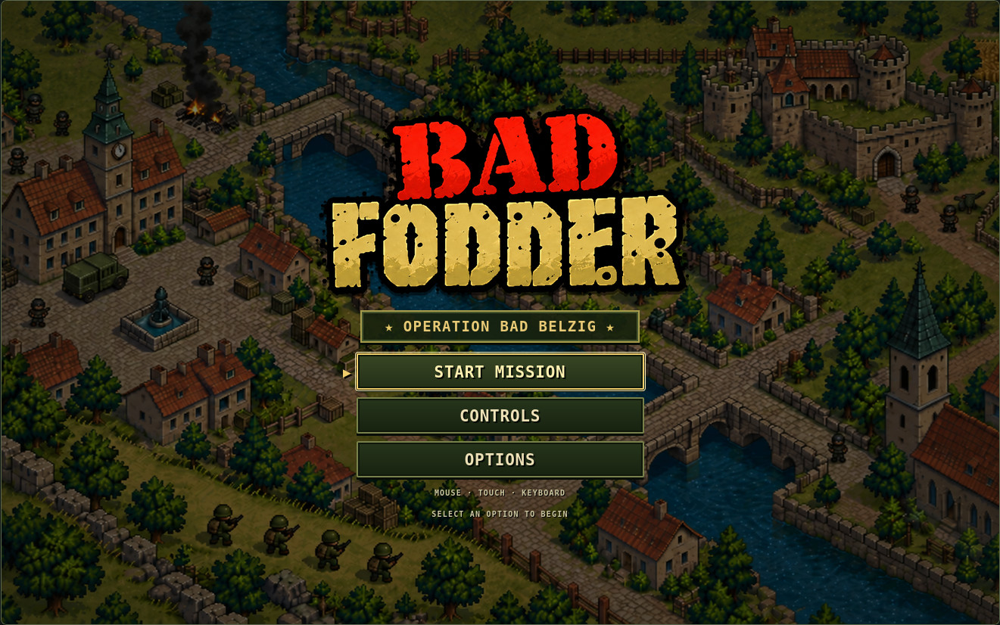
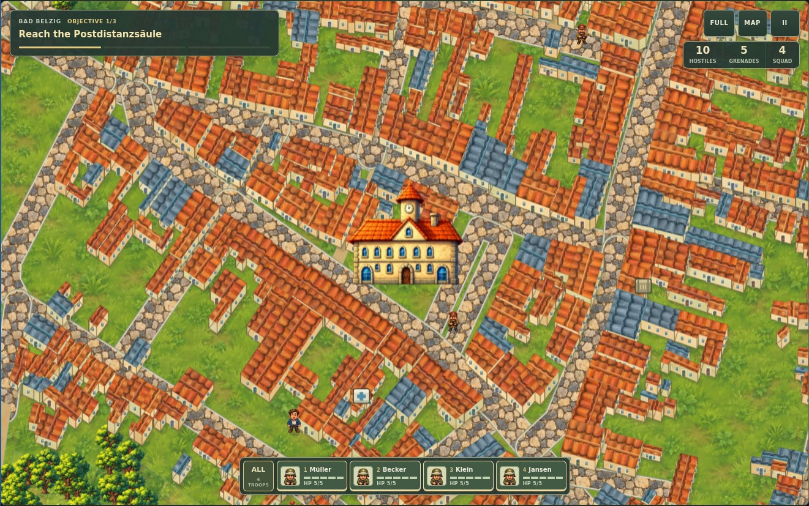
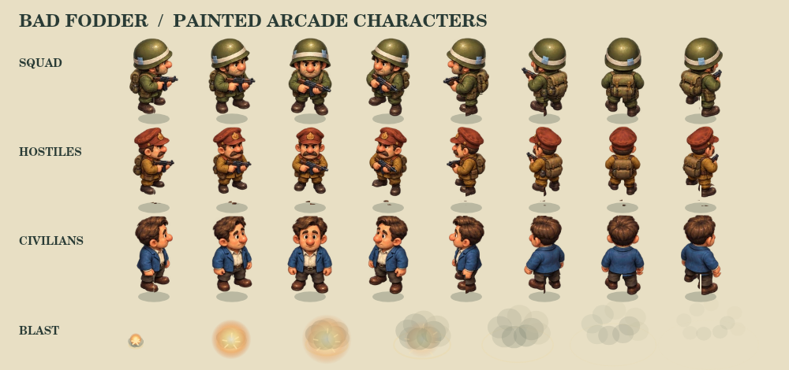
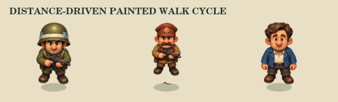

# Bad Fodder

A browser-based top-down tactical game inspired by classic squad-control games and set on a stylised Bad Belzig map.

## Title and pause screens

The game opens on a title screen based on the supplied Bad Fodder artwork. Start Mission becomes available when the town and sprites are ready. The mission does not advance behind the title screen. Controls and Options are available before starting.

Enter or the pause button opens the matching pause screen, with Resume, Restart Mission, Controls, Options and Main Menu. Escape returns from a submenu or resumes a paused mission. Arrow keys move through the menu and Tab stays within it. Mouse and touch controls work throughout.

Options change camera zoom, footstep dust, fullscreen mode and music. The supplied `assets/audio/bad_fodder.mp3` loops continuously across the title screen, mission and pause menu, using the same 22% volume and gentle fades as Sagenhaft. Playback starts after a click, tap or keypress. Music on/off is remembered locally; hiding the tab pauses playback and returning resumes it when enabled. A failed audio load exposes a retry button in Options. Artwork lives in `assets/menu/logo.webp` and `assets/menu/town-background.webp`; both use lossless encoding. The built-in image-generation tool prepared the artwork from the supplied image: remove the baked logo/menu and reconstruct the town background, then extract the red-and-gold Bad Fodder logo on transparency. Menu labels and buttons are live HTML rather than part of the picture.

## Current prototype

- Four-person controllable squad
- Group and individual selection
- Click/tap movement
- Shooting and reloading
- Grenades
- Enemy patrol, alert, pursuit and attack behaviour
- Civilians
- Ammunition and medical pickups
- Camera tracking, zoom and minimap
- Multi-stage mission:
  1. Reach the Postdistanzsäule
  2. Secure Burg Eisenhardt
  3. Clear Marktplatz and Rathaus
- Bad Belzig landmarks and street geometry adapted for tactical gameplay

## Graphics

The game uses painted arcade cartoon artwork inspired by Cannon Fodder: oversized helmets, expressive faces, stocky troops, vibrant terracotta roofs, stone streets and lush foliage. Raster brushwork and material shading replace the flat vector appearance. Ground detail is deliberately softer than characters and landmarks, preserving clear combat silhouettes.

`painted-art.js` loads four optimised WebP atlases before scenery baking and the Start button becomes available. They contain 24 character views, four trees, seven landmarks and four painted materials, totalling about 775 KiB. Images load once; terrain is still baked into the existing visible-tile cache. The existing procedural renderer is a fallback if an atlas fails or takes longer than eight seconds to load.

Troop and civilian legs move independently underneath the painted jacket, with torso sway, breathing, firing recoil and a short collapse. Animation follows distance travelled and stops when movement is blocked. Eight painted facings retain the existing direction threshold. Face portraits use the painted atlas; helmets and enemy caps differ in shape and detail as well as colour.

The built-in image-generation tool created the source artwork. The final prompt set, packing details and asset paths are recorded in [Painted art direction](docs/painted-art-direction.md). Runtime atlases live in `assets/painted/`; no external image service is needed to play.

The play canvas follows screen dimensions and density, capped at a 1600-pixel longest edge on desktop and 1200 pixels on touch devices. Native-resolution scenery tiles keep surfaces clear while high-quality filtering handles zoom. Small overlapping tile gutters prevent seams. Roads, POI positions, building footprints and vegetation anchors stay unchanged.

The unified HUD shows the current objective, three-stage mission progress, combat counters and selectable squad portraits with health bars and numeric HP. Fullscreen, tactical map and pause controls stay available during play. Touch layouts reserve space for the joystick and action buttons in portrait and landscape. The pause control becomes RETRY when the mission ends.

Run `npm test` to check gait timing, blocked actors, update-rate independence, muzzle/recoil timing, direction stability, continuous gait, smooth turning across angle seams, collapse, dust lifetime and scenery cache reuse, eviction, world edges and seam gutters.

Static scenery is cached as visible 512-pixel tiles, with 12 tiles retained on touch devices and 24 on desktop. Views containing more tiles retain all visible tiles to avoid rebuilding them each frame. A separate small overview serves the tactical map. Roads, building footprints, collision geometry and POI coordinates remain in `town-map.js` unchanged. Existing landmark image files are retained but no longer loaded by the game.

## Street navigation

Navigation uses a 12-pixel grid and a consistent 6-pixel ground clearance for route planning, walking and touch movement. Every route segment is checked against building footprints, and soldiers finish corner waypoints before turning. Clicks on blocked landmark footprints lead to a nearby walkable approach. Followers retain single-file positions when a wall prevents the squad from reforming into a wedge, and stalled walkers retry their route. Map geometry and POI positions remain unchanged.

The navigation regression suite runs individual and four-person squad movement to all eight POIs, and checks routes to a destination on every mapped road.

## Controls

### Desktop

- **Move soldiers**: left-click terrain to direct the selected squad
- **Fire machine gun**: hold right-click and aim with the cursor; ammunition is unlimited
- **Throw grenade**: press left + right mouse buttons together
- **View map**: press **M**
- **Pause / resume**: press **Enter** or **Esc**
- **Restart mission**: choose **RESTART MISSION** in the pause menu or the toolbar **Restart** button
- **1-4**: select an individual squad member
- **A**: select all

### Mobile

- **Move**: use the virtual joystick at the bottom-right
- **Fire**: hold the **FIRE** button at the bottom-left
- **Grenade**: tap **GRENADE**; it throws in the squad leader's facing direction
- **Map**: tap **MAP**
- **Pause / resume**: tap the pause button
- **Squad selection**: tap a squad portrait or **ALL** in the in-game HUD
- **Fullscreen**: tap **FULL**, then **EXIT** to return
- **Restart after mission end**: tap **RETRY**
- The touch layout supports portrait and landscape phones and coarse-pointer tablets

Open `index.html` in a browser to play.

## Map data

Road and landmark positions are derived from OpenStreetMap data.

© OpenStreetMap contributors, ODbL 1.0.
